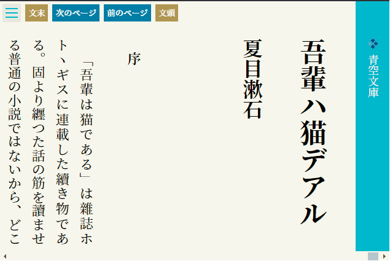
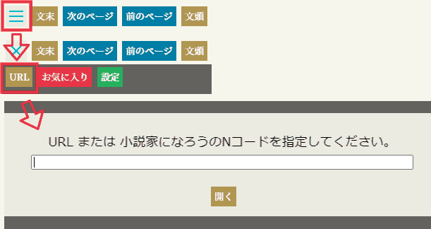

## TxtMiru App

TxtMiru Appは、小説を縦書きで読むことができるアプリです。iPhone、iPad、Androidなどのスマートフォンやタブレット環境でも縦書きで小説を楽しめます

   

### 使い方

1. サイト：[TxtMiru App](https://gearsns.github.io/TxtMiruApp/index.html) にアクセス

2. 小説の表示

   「≡」ボタンを押下

   

   「URL」ボタンを押下

   

3. URLを入力して、「開く」ボタンを押下

   

#### 機能紹介

1. ショートカット(PC用)

   |キー|機能|
   |--|--|
   |Fキー|お気に入り|
   |Lキー|URL|
   |Oキー|ファイルを開く|
   |Cキー|設定|
   |Ctrl + 左矢印|次のエピソード|
   |Ctrl + 右矢印|前のエピソード|

2. お気に入り

   

   よく見るサイトをお気に入りとして登録できます。
   「最新の情報に更新」機能を使用すると小説の総ページ数が最新に更新されます。

3. 設定

   | 機能 | 説明 |
   |--|--|
   |テーマ|「ライト」と「ダーク」の2種類から画面表示を選択可能。 |
   |フォントサイズ|「大」「中」「小」の3段階から好みの大きさに指定。|
   | WebサーバーのURL|（オプション）自分でサー独自に用意したサーバーを使用する場合に変更します。|
   |ユーザーID|（オプション）上記「Webサーバー」の利用時、サーバー上にお気に入りを保存するために指定します。|

